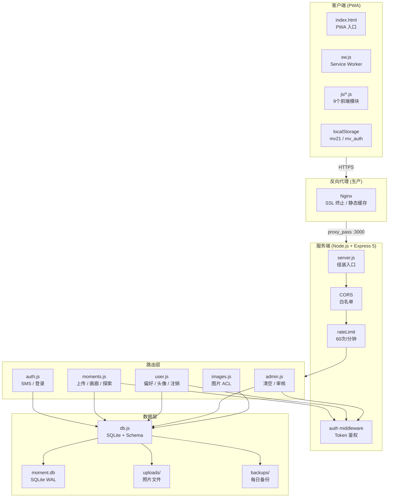
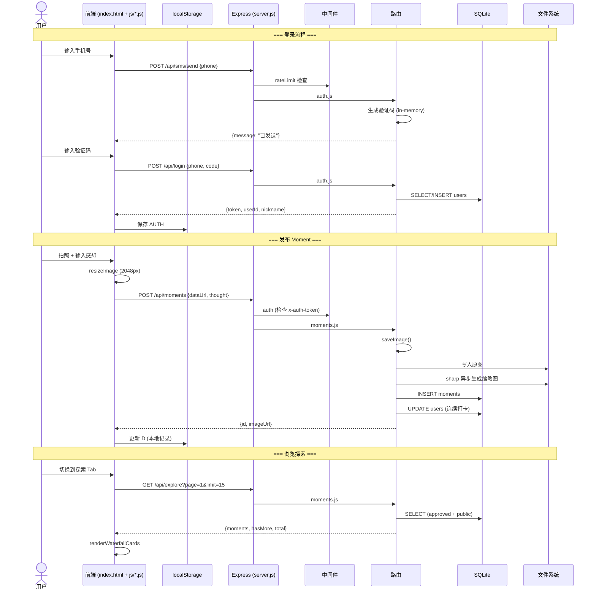
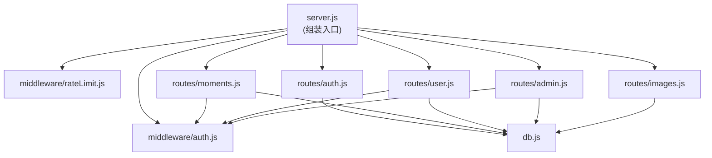
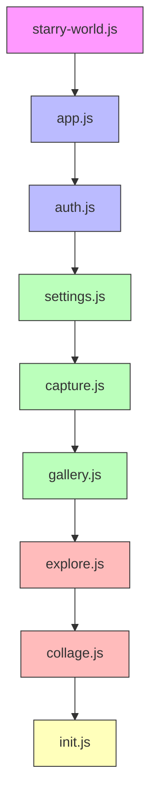
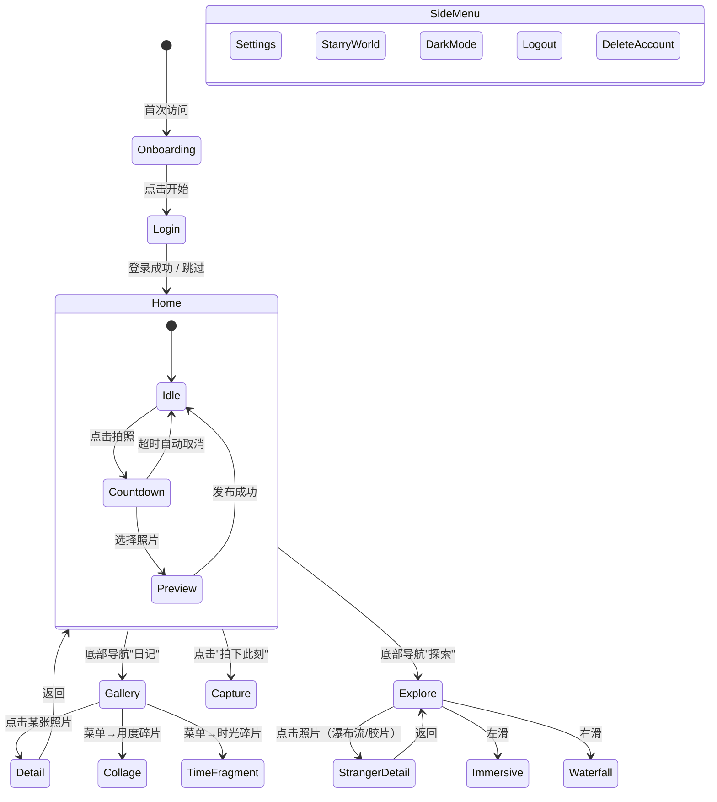
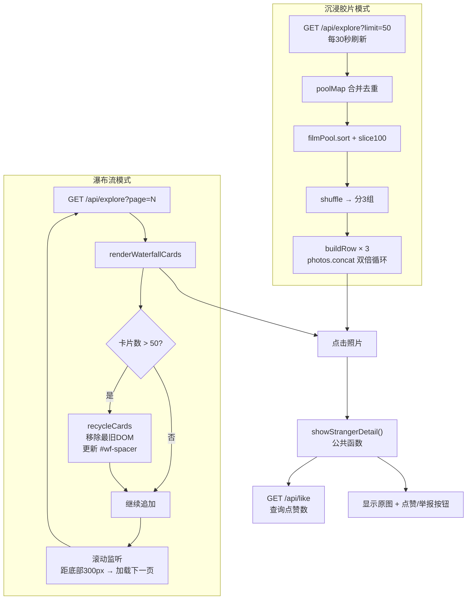
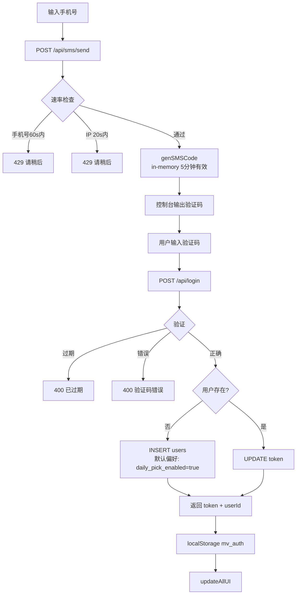

# 此刻 (Moment) — 架构文档

> 基于真实代码生成。所有 Mermaid 图表可在 GitHub/GitLab 及多数 Markdown 渲染器中直接渲染。

---

## 整体架构



---

## 前后端调用关系



---

## 模块依赖图

### 后端



### 前端



**加载顺序**（箭头方向）：starry-world → app → auth → settings → capture → gallery → explore → collage → init

- 🔵 蓝色：核心状态和认证
- 🟢 绿色：核心功能（拍照/画廊/设置）
- 🔴 红色：复杂功能（探索/拼贴）
- 🟡 黄色：初始化入口
- 🟣 紫色：独立组件

---

## 页面跳转关系



---

## 数据流图

### 发布 Moment 数据流

```mermaid
flowchart LR
    A[用户拍照] --> B[resizeImage<br/>2048px + 去黑边 + JPEG Q85]
    B --> C{在线?}
    C -->|是| D[POST /api/moments<br/>base64 + thought]
    C -->|否| E[localStorage<br/>_pending: true]
    E --> F[online 事件触发<br/>processPendingQueue]
    F --> D
    D --> G[saveImage<br/>魔法字节校验 + 写磁盘]
    G --> H[sharp 异步<br/>生成400px缩略图]
    G --> I[INSERT moments]
    I --> J[UPDATE users<br/>连续打卡天数]
    J --> K[返回 id + imageUrl]
    K --> L[D.m.unshift<br/>更新本地状态]
    L --> M[save() → localStorage]
    M --> N[updateAllUI]
```

### 探索广场数据流



### 登录认证数据流



---

## 组件交互矩阵

| 组件 | app.js | auth.js | settings.js | capture.js | gallery.js | explore.js | collage.js | init.js |
|------|--------|---------|-------------|------------|------------|------------|------------|---------|
| **app.js** | — | 被调 | 被调 | 被调 | 被调 | 被调 | 被调 | 被调 |
| **auth.js** | 调用 | — | 调用 | 调用 | 调用 | 调用 | — | 调用 |
| **settings.js** | 调用 | 调用 | — | 调用 | 调用 | 调用 | — | 调用 |
| **capture.js** | 调用 | 调用 | 调用 | — | 调用 | 调用 | — | — |
| **gallery.js** | 调用 | 调用 | 调用 | 被调 | — | 被调 | 被调 | 被调 |
| **explore.js** | 调用 | 调用 | 调用 | 调用 | 调用 | — | — | — |
| **collage.js** | 调用 | — | 调用 | — | 调用 | — | — | — |
| **init.js** | 调用 | 调用 | 调用 | — | 调用 | — | — | — |

"调用" = 行模块调用列模块的函数，"被调" = 列模块调用行模块的函数

---

## 技术决策记录

| 决策 | 原因 |
|------|------|
| SQLite 而非 MySQL/PostgreSQL | 零运维、单文件备份、够用的并发（单进程） |
| WAL 模式 | 读写并发性能更好 |
| better-sqlite3 (同步) | 比异步驱动简单，单进程场景无阻塞问题 |
| Vanilla JS 零构建 | 减少构建链复杂度，适合小型团队 |
| 全局函数通信而非 ES Module | 保持零构建，多 script 标签直接加载 |
| sharp (可选依赖) | 缩略图性能好，未安装时优雅降级 |
| in-memory 限流 + SMS code | 简单够用，重启丢失可接受 |
| Token 90天过期 | 平衡安全性和用户体验 |
| PWA 而非 App Store | 绕过审核、即时更新、跨平台 |
