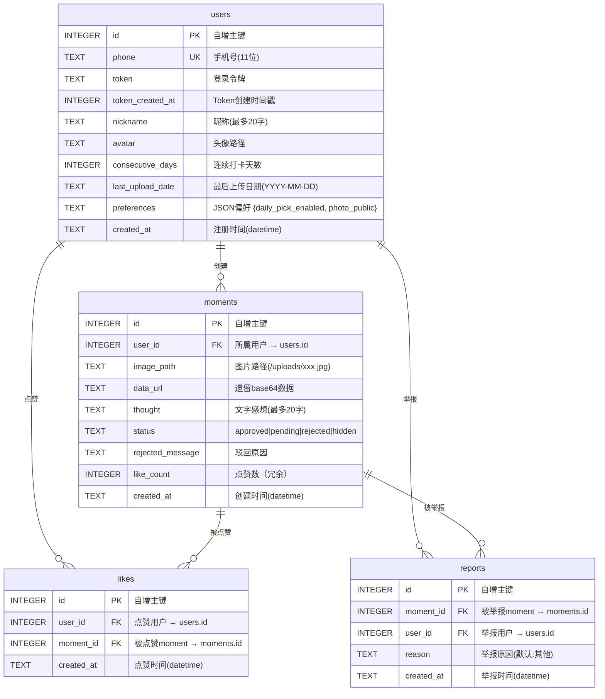
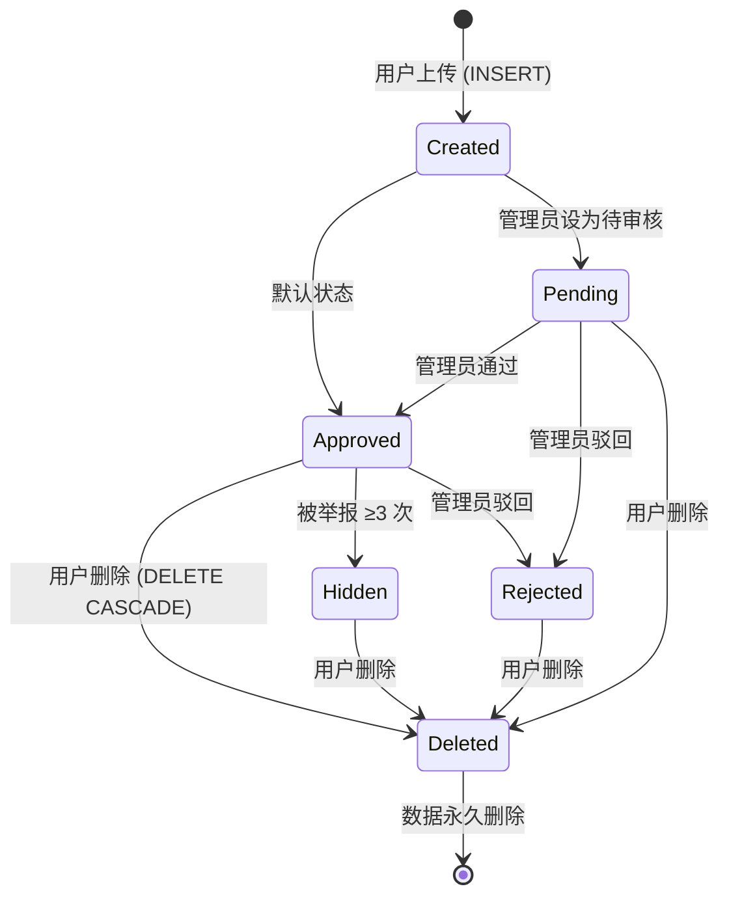
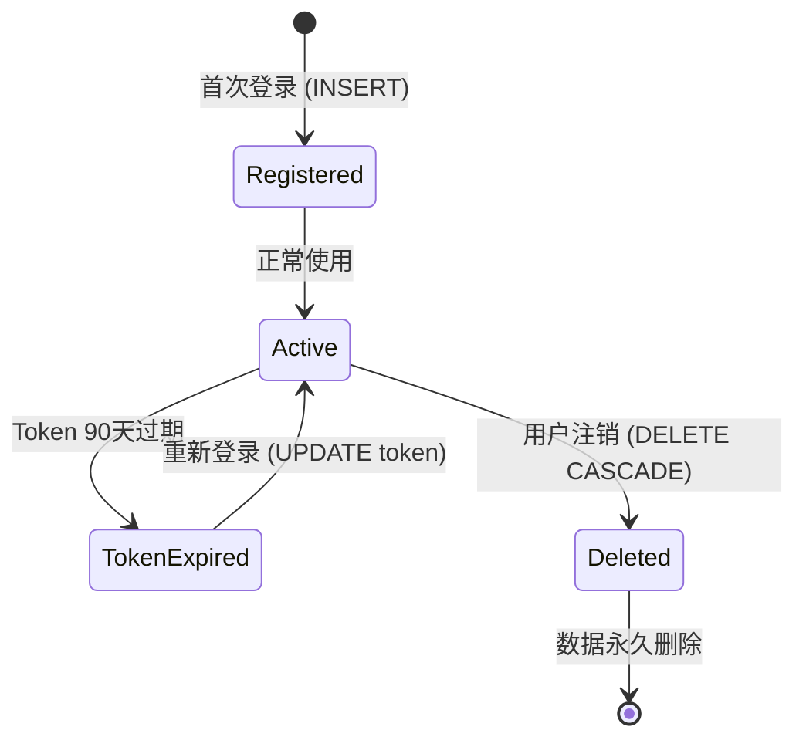

# 此刻 (Moment) — 数据库文档

> 基于 `db.js` Schema 真实定义生成。

---

## ER 图



---

## 数据表详细说明

### 1. users — 用户表

| 字段 | 类型 | 约束 | 默认值 | 说明 |
|------|------|------|--------|------|
| `id` | INTEGER | PRIMARY KEY AUTOINCREMENT | 自动 | 用户唯一标识，1=管理员 |
| `phone` | TEXT | UNIQUE NOT NULL | — | 11位手机号 |
| `token` | TEXT | — | `''` | 登录令牌，格式 `tok_` + 12位hex |
| `token_created_at` | INTEGER | — | 0 | Token创建时间戳（毫秒），用于90天过期判断 |
| `nickname` | TEXT | — | `''` | 用户昵称，最多20字符（服务端限制） |
| `avatar` | TEXT | — | `''` | 头像图片路径，如 `/uploads/xxx.jpg` 或空 |
| `consecutive_days` | INTEGER | — | 0 | 连续打卡天数 |
| `last_upload_date` | TEXT | — | `''` | 最后上传日期，格式 `YYYY-MM-DD` |
| `preferences` | TEXT | — | `'{}'` | JSON字符串，包含 `daily_pick_enabled` 和 `photo_public` |
| `created_at` | TEXT | — | `datetime('now')` | 注册时间 |

**SQL**:
```sql
CREATE TABLE IF NOT EXISTS users (
    id INTEGER PRIMARY KEY AUTOINCREMENT,
    phone TEXT UNIQUE NOT NULL,
    token TEXT DEFAULT '',
    token_created_at INTEGER DEFAULT 0,
    nickname TEXT DEFAULT '',
    avatar TEXT DEFAULT '',
    consecutive_days INTEGER DEFAULT 0,
    last_upload_date TEXT DEFAULT '',
    preferences TEXT DEFAULT '{}',
    created_at TEXT DEFAULT (datetime('now'))
);
```

**preferences JSON 结构**:
```json
{
  "daily_pick_enabled": true,   // 每日精选推送开关
  "photo_public": true          // 照片是否默认公开
}
```

---

### 2. moments — 照片表

| 字段 | 类型 | 约束 | 默认值 | 说明 |
|------|------|------|--------|------|
| `id` | INTEGER | PRIMARY KEY AUTOINCREMENT | 自动 | 照片唯一标识 |
| `user_id` | INTEGER | NOT NULL, FK → users.id ON DELETE CASCADE | — | 所属用户 |
| `image_path` | TEXT | — | `''` | 图片文件路径，如 `/uploads/abc123.jpg` |
| `data_url` | TEXT | — | `''` | 遗留字段，历史base64数据（已不再使用） |
| `thought` | TEXT | — | `''` | 文字感想，服务端限制20字符 |
| `status` | TEXT | — | `'approved'` | 状态：`approved` / `pending` / `rejected` / `hidden` |
| `rejected_message` | TEXT | — | `''` | 管理员驳回原因，最多200字符 |
| `like_count` | INTEGER | — | 0 | 点赞数冗余字段（减少JOIN） |
| `created_at` | TEXT | — | `datetime('now')` | 创建时间 |

**SQL**:
```sql
CREATE TABLE IF NOT EXISTS moments (
    id INTEGER PRIMARY KEY AUTOINCREMENT,
    user_id INTEGER NOT NULL,
    image_path TEXT DEFAULT '',
    data_url TEXT DEFAULT '',
    thought TEXT DEFAULT '',
    status TEXT DEFAULT 'approved',
    rejected_message TEXT DEFAULT '',
    like_count INTEGER DEFAULT 0,
    created_at TEXT DEFAULT (datetime('now')),
    FOREIGN KEY (user_id) REFERENCES users(id) ON DELETE CASCADE
);
```

**status 状态机**:
```
        上传
         ↓
     approved ──────────→ pending (审核中)
         │                    │
         │  3次举报           │ 审核通过
         ▼                    ▼
      hidden               approved
                             │
                             │ 审核驳回
                             ▼
                          rejected
```

---

### 3. likes — 点赞表

| 字段 | 类型 | 约束 | 默认值 | 说明 |
|------|------|------|--------|------|
| `id` | INTEGER | PRIMARY KEY AUTOINCREMENT | 自动 | 点赞记录ID |
| `user_id` | INTEGER | NOT NULL, FK → users.id ON DELETE CASCADE | — | 点赞用户 |
| `moment_id` | INTEGER | NOT NULL, FK → moments.id ON DELETE CASCADE | — | 被点赞moment |
| `created_at` | TEXT | — | `datetime('now')` | 点赞时间 |

**SQL**:
```sql
CREATE TABLE IF NOT EXISTS likes (
    id INTEGER PRIMARY KEY AUTOINCREMENT,
    user_id INTEGER NOT NULL,
    moment_id INTEGER NOT NULL,
    created_at TEXT DEFAULT (datetime('now')),
    UNIQUE(user_id, moment_id),
    FOREIGN KEY (user_id) REFERENCES users(id) ON DELETE CASCADE,
    FOREIGN KEY (moment_id) REFERENCES moments(id) ON DELETE CASCADE
);
```

**约束**: `UNIQUE(user_id, moment_id)` — 每个用户对每张照片只能点赞一次。

---

### 4. reports — 举报表

| 字段 | 类型 | 约束 | 默认值 | 说明 |
|------|------|------|--------|------|
| `id` | INTEGER | PRIMARY KEY AUTOINCREMENT | 自动 | 举报记录ID |
| `moment_id` | INTEGER | NOT NULL, FK → moments.id ON DELETE CASCADE | — | 被举报moment |
| `user_id` | INTEGER | NOT NULL, FK → users.id ON DELETE CASCADE | — | 举报用户 |
| `reason` | TEXT | — | `'其他'` | 举报原因 |
| `created_at` | TEXT | — | `datetime('now')` | 举报时间 |

**SQL**:
```sql
CREATE TABLE IF NOT EXISTS reports (
    id INTEGER PRIMARY KEY AUTOINCREMENT,
    moment_id INTEGER NOT NULL,
    user_id INTEGER NOT NULL,
    reason TEXT DEFAULT '其他',
    created_at TEXT DEFAULT (datetime('now')),
    UNIQUE(moment_id, user_id),
    FOREIGN KEY (user_id) REFERENCES users(id) ON DELETE CASCADE,
    FOREIGN KEY (moment_id) REFERENCES moments(id) ON DELETE CASCADE
);
```

**约束**: `UNIQUE(moment_id, user_id)` — 每个用户对每张照片只能举报一次。

**自动隐藏规则**: 同一 `moment_id` 在 `reports` 表中有 ≥3 条记录时，对应的 `moments.status` 自动设置为 `'hidden'`。

---

## 索引

| 索引名 | 表 | 字段 | 用途 |
|--------|-----|------|------|
| `idx_moments_user_id` | moments | user_id | 加速用户画廊查询 (`WHERE user_id = ?`) |
| `idx_moments_status` | moments | status | 加速探索广场过滤 (`WHERE status = 'approved'`) |
| `idx_moments_created_at` | moments | created_at DESC | 加速时间降序排序 (`ORDER BY created_at DESC`) |
| `idx_likes_moment_id` | likes | moment_id | 加速点赞查询 (`WHERE moment_id = ?`) |
| `idx_reports_moment_id` | reports | moment_id | 加速举报查询 (`WHERE moment_id = ?`) |

**SQL**:
```sql
CREATE INDEX IF NOT EXISTS idx_moments_user_id ON moments(user_id);
CREATE INDEX IF NOT EXISTS idx_moments_status ON moments(status);
CREATE INDEX IF NOT EXISTS idx_moments_created_at ON moments(created_at DESC);
CREATE INDEX IF NOT EXISTS idx_likes_moment_id ON likes(moment_id);
CREATE INDEX IF NOT EXISTS idx_reports_moment_id ON reports(moment_id);
```

---

## 数据生命周期

### Moment 生命周期



**级联删除**: 删除 moment 时，自动删除对应的 likes、reports 记录以及磁盘上的图片文件（含缩略图）。

### 用户数据生命周期



**级联删除**: 注销用户时，自动删除该用户的所有 moments、likes、reports 以及对应的图片文件。管理员（user ID 1）不可注销。

### Token 生命周期

```
生成: 登录时 crypto.randomBytes(6).toString('hex') → "tok_xxxxxxxxxxxx"
存储: users.token + users.token_created_at (毫秒时间戳)
验证: 每次请求通过 auth 中间件检查
过期: 创建后 90 天自动失效
刷新: 每次登录生成新 token，旧 token 被覆盖
客户端: localStorage mv_auth → {token, tokenCreatedAt, userId}
```

---

## WAL 模式说明

### 文件说明

| 文件 | 说明 |
|------|------|
| `moment.db` | 主数据库文件 |
| `moment.db-wal` | Write-Ahead Log（写前日志，待合并的修改） |
| `moment.db-shm` | WAL 索引共享内存 |

### Checkpoint 策略

| 类型 | 频率 | 操作 |
|------|------|------|
| `PASSIVE` | 每 5 分钟 | 合并 WAL 到主文件（非阻塞） |
| `TRUNCATE` | 每日凌晨 4:00 | 完全重置 WAL 文件（接近零大小） |

### 备份策略

```
每日凌晨 4:00 (TRUNCATE checkpoint 后)
  ├── 复制 moment.db → data/backups/moment-YYYY-MM-DD.db
  ├── 保留最近 7 天的备份
  └── 自动清理 7 天前的备份文件
```

---

## 常用查询

### 探索广场（最常用查询）
```sql
SELECT m.id, m.image_path, m.data_url, m.thought, m.created_at, m.like_count,
       m.user_id, u.phone
FROM moments m
JOIN users u ON u.id = m.user_id
WHERE m.status = 'approved'
  AND (json_extract(u.preferences, '$.photo_public') IS NULL
       OR json_extract(u.preferences, '$.photo_public') != 'false')
ORDER BY m.created_at DESC
LIMIT 15 OFFSET 0;
```

### 用户画廊
```sql
SELECT id, image_path, data_url, thought, created_at, status, rejected_message, like_count
FROM moments
WHERE user_id = ? AND status != 'hidden'
ORDER BY created_at DESC
LIMIT 100;
```

### 审核列表（管理员）
```sql
SELECT m.id, m.image_path, m.thought, m.status, m.created_at,
       u.phone, u.nickname,
       COUNT(rpt.id) as report_count
FROM moments m
JOIN users u ON u.id = m.user_id
LEFT JOIN reports rpt ON rpt.moment_id = m.id
WHERE m.status IN ('approved', 'pending')
GROUP BY m.id
HAVING report_count > 0 OR m.status = 'pending'
ORDER BY report_count DESC, m.created_at DESC;
```

### 手动维护
```sql
-- 查看表大小
SELECT name, COUNT(*) as rows FROM sqlite_master WHERE type='table' GROUP BY name;

-- 手动 checkpoint
PRAGMA wal_checkpoint(TRUNCATE);

-- 查看索引
SELECT * FROM sqlite_master WHERE type='index';

-- 手动清理过期 token
UPDATE users SET token = '' WHERE token_created_at < (unixepoch() - 7776000) * 1000;
```
