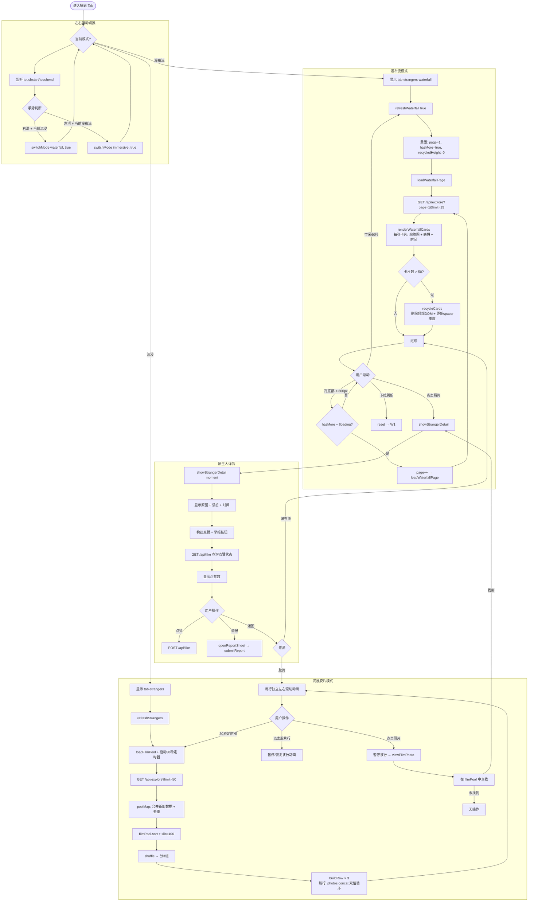
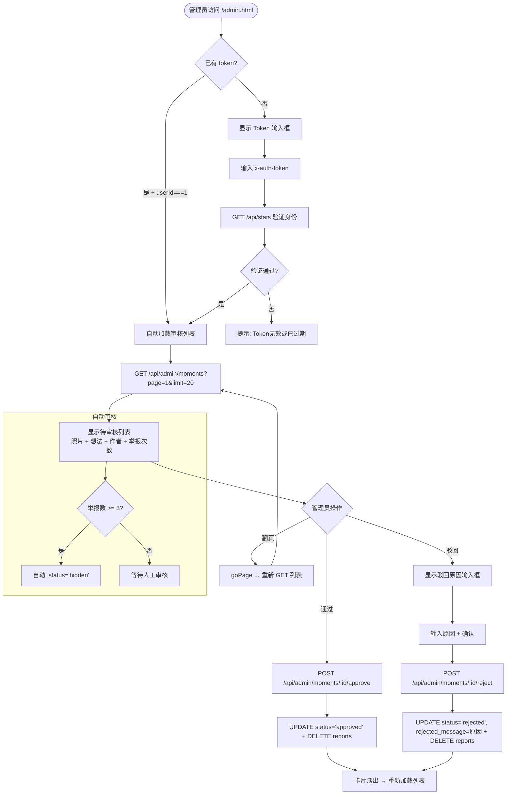
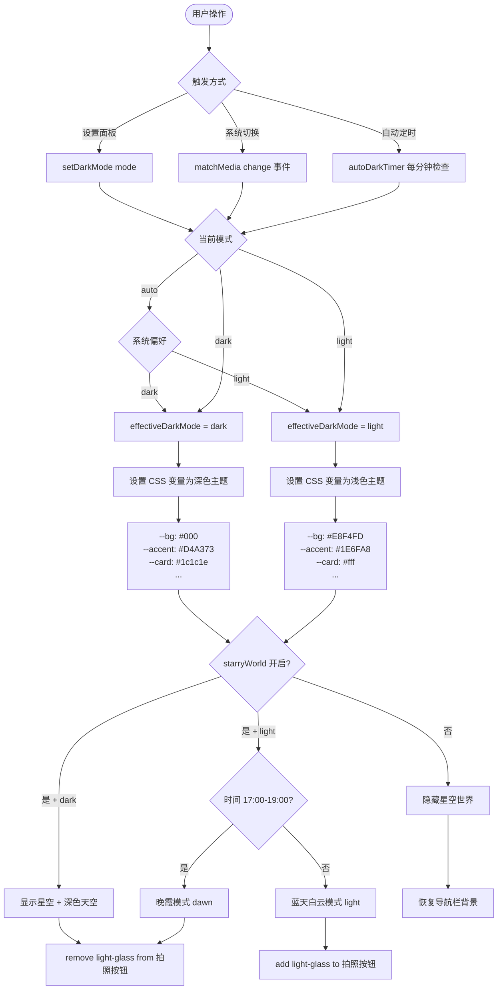

# 此刻 (Moment) — 流程图文档

> 基于真实代码逻辑生成。所有图表使用 Mermaid 语法。

---

## 1. 登录流程

```mermaid
flowchart TD
    A([用户打开应用]) --> B{已登录?}
    B -->|是| C[读取 localStorage mv_auth]
    C --> D[恢复 AUTH token]
    D --> E[updateAllUI + processPendingQueue]

    B -->|否| F{首次访问?}
    F -->|是| G[显示引导页<br/>3页滑动]
    G --> H[点击"开始"]
    H --> I[显示登录界面]

    F -->|否| I[显示登录界面]

    I --> J[输入手机号]
    J --> K[点击"获取验证码"]

    K --> L{频率检查}
    L -->|手机号60s冷却| M[提示: 验证码请求过于频繁]
    L -->|IP 20s冷却| M
    L -->|通过| N[POST /api/sms/send]

    N --> O{生产环境?}
    O -->|是| P[发送真实短信]
    O -->|否 + DEV_LOGIN=1| Q[打印验证码到控制台]

    P --> R[用户输入验证码]
    Q --> R
    R --> S[点击"登录/注册"]

    S --> T[POST /api/login]
    T --> U{验证码正确?}
    U -->|错误| V[提示错误]
    U -->|过期| W[提示过期, 重新获取]
    U -->|正确| X{用户存在?}

    X -->|否| Y[INSERT users<br/>默认偏好: daily_pick_enabled=true]
    X -->|是| Z[UPDATE token + token_created_at]
    Y --> AA[生成 token: tok_ + 12位hex]
    Z --> AA

    AA --> AB[返回 {token, userId, nickname, avatar, preferences}]
    AB --> AC[localStorage: mv_auth, mv_has_logged_in]
    AC --> AD{本地有旧记录?}
    AD -->|是| AE[确认: 用服务端数据覆盖?<br/>自动备份本地数据到 mv21_backup]
    AD -->|否| AF[清空本地记录]
    AE --> AF
    AF --> AG[updateSideMenuUser + updateAllUI]
    AG --> AH[关闭登录界面]
    AH --> AI([进入首页])

    V --> R
    W --> J
    M --> J
```

---

## 2. 发布 Moment 流程

```mermaid
flowchart TD
    A([首页: 点击"拍下此刻"]) --> B{todayPhotoIdx}
    B -->|今天已拍| C[viewTodayPhoto<br/>查看今日照片]
    B -->|今天未拍| D[pick() — 启动60秒倒计时]

    D --> E[触发 file input<br/>capture=environment]
    E --> F[用户拍照 / 选择照片]

    F --> G[gotPhoto — FileReader 读取]
    G --> H[resizeImage<br/>缩放2048px → 去黑边 → JPEG Q85]
    H --> I[显示预览界面<br/>照片 + 感想输入框]

    I --> J{60秒倒计时}
    J -->|用户输入感想+点击发布| K[saveMoment()]
    J -->|倒计时结束| L[cancelPhoto()]
    L --> K

    K --> M{已登录?}
    M -->|否| N[仅存 localStorage<br/>D.m.unshift + save()]
    N --> O[afterCaptureBack → 回到首页]

    M -->|是| P{navigator.onLine?}
    P -->|离线| Q[localStorage _pending: true<br/>Toast: 已保存, 联网后自动上传]
    Q --> O

    P -->|在线| R[POST /api/moments<br/>{dataUrl, thought}]

    R --> S{服务端处理}
    S --> T[saveImage: 解析base64]
    T --> U{魔法字节校验}
    U -->|无效| V[400: 图片数据无效或过大]
    U -->|通过| W{大小 ≤ 20MB?}
    W -->|否| V
    W -->|是| X[写入磁盘 /uploads/xxx.jpg]

    X --> Y[sharp 异步: 生成400px缩略图]
    X --> Z[UPDATE users: 连续打卡天数]
    Z --> AA[INSERT moments]
    AA --> AB[返回 {id, imageUrl}]

    AB --> AC[D.m.unshift: 保存到本地]
    AC --> AD[afterCaptureBack → 回到首页]
    AD --> AE[updateAllUI: 刷新首页状态]
    AE --> AF([首页: 显示"今日已记录"])

    V --> AG[alert 错误信息]
    AG --> AH[用户重试 / 返回]
```

---

## 3. 图片上传服务端详细流程

```mermaid
flowchart TD
    A[POST /api/moments<br/>auth 中间件通过] --> B{dataUrl 存在?}
    B -->|否| C[400: 缺少照片]
    B -->|是| D[saveImage(dataUrl)]

    D --> E{包含 'base64,'?}
    E -->|否| F[return null]
    E -->|是| G[正则提取: ext + base64数据]

    G --> H{Buffer 解析成功?}
    H -->|否| I[return null]
    H -->|是| J{长度 ≥ 4 字节?}
    J -->|否| I

    J -->|是| K{ext === 'jpg'?}
    K -->|是| L{前2字节 == FF D8?}
    L -->|否| M[ERROR: Invalid JPEG magic bytes]
    M --> I

    K -->|否| N{前4字节 == 89 50 4E 47?}
    N -->|否| O[ERROR: Invalid PNG magic bytes]
    O --> I

    L -->|是| P{大小 ≤ 20MB?}
    N -->|是| P
    P -->|否| Q[ERROR: Image too large]
    Q --> I

    P -->|是| R[生成随机文件名: 12位hex.ext]
    R --> S[fs.writeFileSync: 写入磁盘]
    S --> T{sharp 已安装?}

    T -->|是| U[sharp(buf).resize(400).jpeg(70).toFile]
    U --> V[异步: 缩略图生成成功/失败]
    T -->|否| W[跳过缩略图]

    S --> X[return '/uploads/filename.ext']

    X --> Y{imagePath 非空?}
    Y -->|是| Z[继续: 更新打卡 + INSERT]
    Y -->|否| AA[400: 图片数据无效或过大]

    I --> AA
```

---

## 4. Gallery 流程

```mermaid
flowchart TD
    A([进入日记 Tab]) --> B[refreshGallery]

    B --> C{已登录?}
    C -->|是| D[GET /api/gallery<br/>limit 100, WHERE status != 'hidden']
    C -->|否| E[直接 renderGallery]

    D --> F{服务端返回 moments?}
    F -->|是| G[遍历: 合并到本地 D.m]
    F -->|否| E

    G --> H{匹配方式}
    H --> I1[按 id 匹配]
    H --> I2[按 imageUrl 匹配 + 时间差 < 5s]
    H --> I3[按 _localId 标记匹配]
    I1 --> J[更新: status, rejectedMessage, id, u]
    I2 --> J
    I3 --> J
    J --> K[清除 _localId 标记]
    K --> L[D.c = D.m.length + save()]

    L --> E
    E --> M{D.m.length > 0?}
    M -->|否| N[显示"还没有记录"]
    M -->|是| O[按日期分组]

    O --> P[遍历每一天]
    P --> Q[显示日期标签<br/>今天 / 昨天 / 具体日期]
    Q --> R[遍历当天照片]

    R --> S{状态检查}
    S --> T1[pending → 标签: 审核中]
    S --> T2[rejected → 标签: 已被移除, 不可点击]
    S --> T3[hidden → 标签: 审核中]
    S --> T4[_pending → 标签: 等待上传]
    S --> T5[approved → 正常显示]

    T1 --> U[渲染缩略图 + 感想 + 时间]
    T2 --> U
    T3 --> U
    T4 --> U
    T5 --> U

    U --> V{点击照片?}
    V -->|是 + 可点击| W[view(i)]
    V -->|是 + 不可点击| X[无反应]
    V -->|否| Y[继续浏览]

    W --> Z{status === 'rejected'?}
    Z -->|是| AA[显示 SVG 占位图 + 驳回原因]
    Z -->|否| AB[显示原图 + 感想 + 日期]
    AA --> AC[显示详情覆盖层<br/>支持删除]
    AB --> AC
```

---

## 5. Explore 流程



---

## 6. 审核流程



---

## 7. 离线队列恢复流程

```mermaid
flowchart TD
    A[触发: 应用启动 / online 事件] --> B{processPendingQueue}

    B --> C{_processingQueue?}
    C -->|处理中| D[跳过]
    C -->|空闲| E{已登录 + 在线?}

    E -->|否| F[跳过]
    E -->|是| G[扫描 D.m 中 _pending===true 的条目]

    G --> H{有待上传条目?}
    H -->|否| I[跳过]
    H -->|是| J[设置 _processingQueue=true]

    J --> K[逐条处理: processNext 0]
    K --> L[POST /api/moments<br/>{dataUrl, thought}]

    L --> M{上传结果}
    M -->|成功| N[清除 _pending<br/>更新 id + imageUrl<br/>success++]
    M -->|失败| O[保留 _pending<br/>fail++]

    N --> P{还有下一条?}
    O --> P
    P -->|是| K
    P -->|否| Q[设置 _processingQueue=false]

    Q --> R{success > 0?}
    R -->|是| S[Toast: 已自动上传N条离线记录]
    R -->|否| T[静默完成]
    S --> U[updateAllUI]
    T --> U
```

---

## 8. 深色模式切换流程


